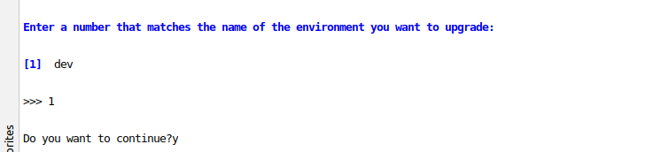
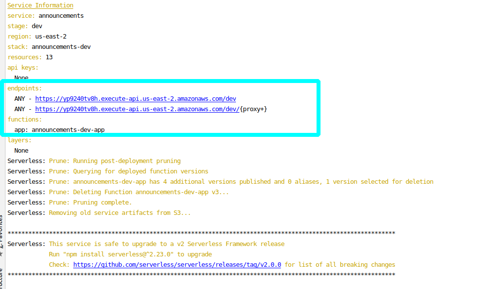
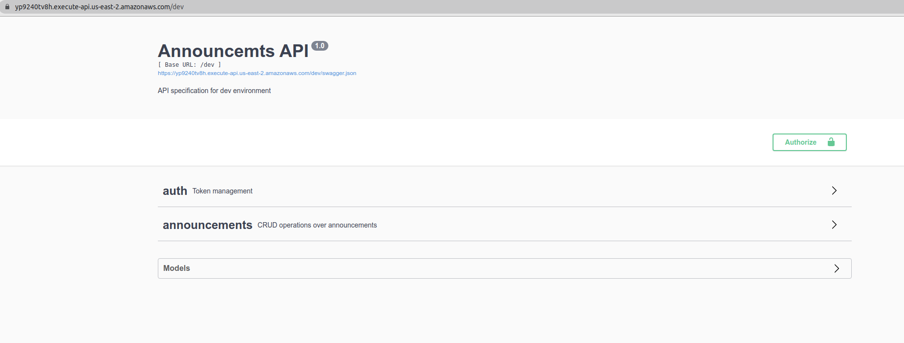
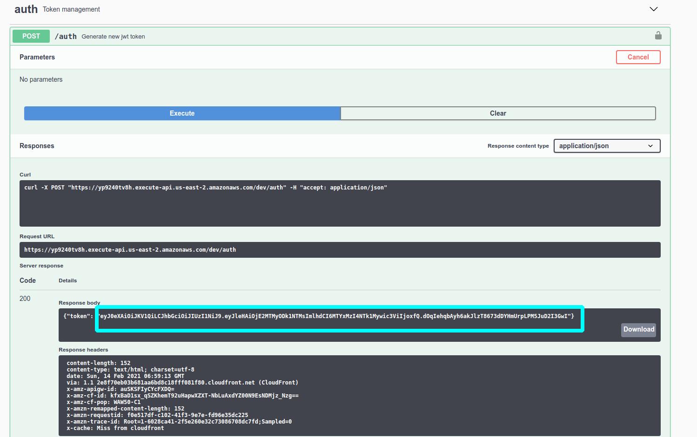
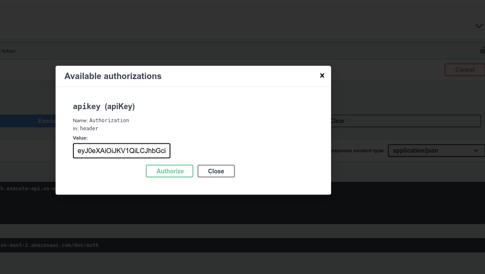

# Announcements API

### Prerequisites

To simplify the work with the repository, 
all basic commands are grouped using bash scripts and can be run using the make utility.

Make is installed by default on Unix systems such as Ubuntu or Mac

To execute the command, simply type `make <command>` in the terminal

|   command	|  description   	|
|---	|---	|
|  init	|  Install the necessary dependencies for local development and deployment. Checks for the presence of npm, node.js, pip and, if necessary, installs \ updates them. Automatically activates pipenv. |
|  run 	|   Start local development server	|
|  deploy 	|   Deployment / update of the stack in the cloud. Apply the command and then follow the instructions to select the appropriate environment for deployment / update (only dev environment is available for simplicity)	|

### Getting started

Use `make init` command in order to install all necessary dependencies

! A local version of DynamoDB will be installed which takes quite a long time to install. Please do not interrupt the script execution!

You can also install all the necessary dependencies manually if make init does not work for some reason

* Update or install Node js
* Run npm install
* Run node_modules/serverless/bin/serverless.js dynamodb install (Only needed if you are going to run the stack locally)

### Run locally

Use `make run` command in order to run stack locally

You can also run stack manually if make run does not work for some reason:

    node_modules/serverless/bin/serverless.js wsgi serve  & node_modules/serverless/bin/serverless.js dynamodb start 

Swagger will be available at the root url `localhost: 5000`

Please follow the link `localhost: 500` to perform swagger operations

### API

Application uses Bearer token scheme authorization (`Authorization Bearer <token>`  header in  request)

    POST <base url>/auth              Generate a token. Use this endpoint first to generate new auth token
    POST <base url>/announcements     Create new announcement (title and description are required fields)
    GET <base url>/announcements      List of announcements
    
### Deploy stack and use Swagger

Use `make deploy` command in order to deploy stack. 

Your aws account must have permissions that allow cloudformation to perform unwrapping operations on your behalf !!

* Select 1 (This corresponds to dev env and this is only one available option) then confirm by entering y or yes:

* Upon completion of the process, you will see brief information about the stack, as well as urls by which the stack will be available:

* Follow the top link by clicking on it:

* Go to the namespace `auth > try it out > execute` and then copy the token you received in the response

* Click on the uthorize button at the top and paste the token there and then click authorize again. Now the token will be automatically sent to the header with each of your requests

* Now you can execute another endpoints

### Stack elements

The stack consists of DynamoDb, lambla, SSM parameters (secret storage for jwt token), cloudwatch and IAM policy, SNS (for cloudwatch alarms), Cloudwatch Alarm and MetricFilter.
These services and this approach (using serverless framework and plugins) were chosen for reasons of cost and development speed.

### Monitoring and alerts

The stack creates dynamoDb ConsumedWriteCapacityUnits alarm which is quite important for
dynamoDb as it allows detecting low database throughput early on. There is also a lambda
MetricFilter that scans the 'ERROR' pattern among the logs. Based on this metric, 
you can build an alarm to detect when the lambda falls with an error.

Of course, there are many more important alarms and metrics that can be implemented.

For lambda I would highlight Throttles, ProvisionedConcurrencyInvocations and DestinationDeliveryFailures 
metrics on which alarms can be built

For dynamoDB I would highlight ConditionalCheckFailedRequests, ReadThrottleEvents,
 ThrottledRequests, TransactionConflict, UserErrors, WriteThrottleEvents.

